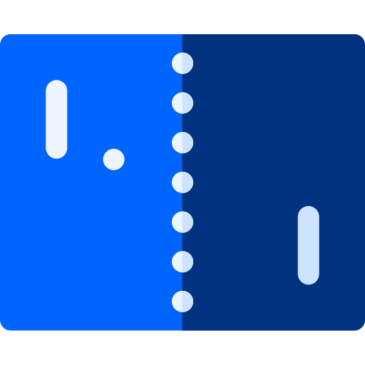
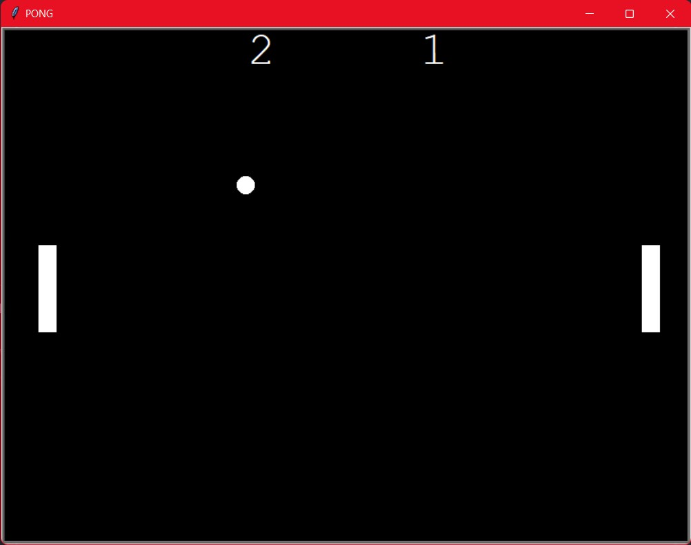

<h2 align="center"><b>PONG GAME</b></h2>
<h4 align="center">Pong game made with Python</h4>

 

<h3 align="center"><strong>Star :star:  this repo to show your support and it really does matter!</strong> :clap:</h4>

## Screenshot

## Description

Pong is a table tennis-themed twitch arcade sport video game, featuring two paddles and a ball. Players use the paddles to hit a ball back and forth.

### Technologies used

- Python
- Turtle Module

## Contribution

Your ideas, translations, design changes, code cleaning, or real heavy code changes or any help is always welcome. The more is contribution the better it gets

[Pull requests](https://github.com/pong/pulls) will be reviewed

#### Known issues and limitations

- Sometimes app crashed after pressing submit button
